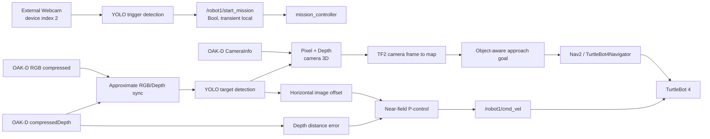
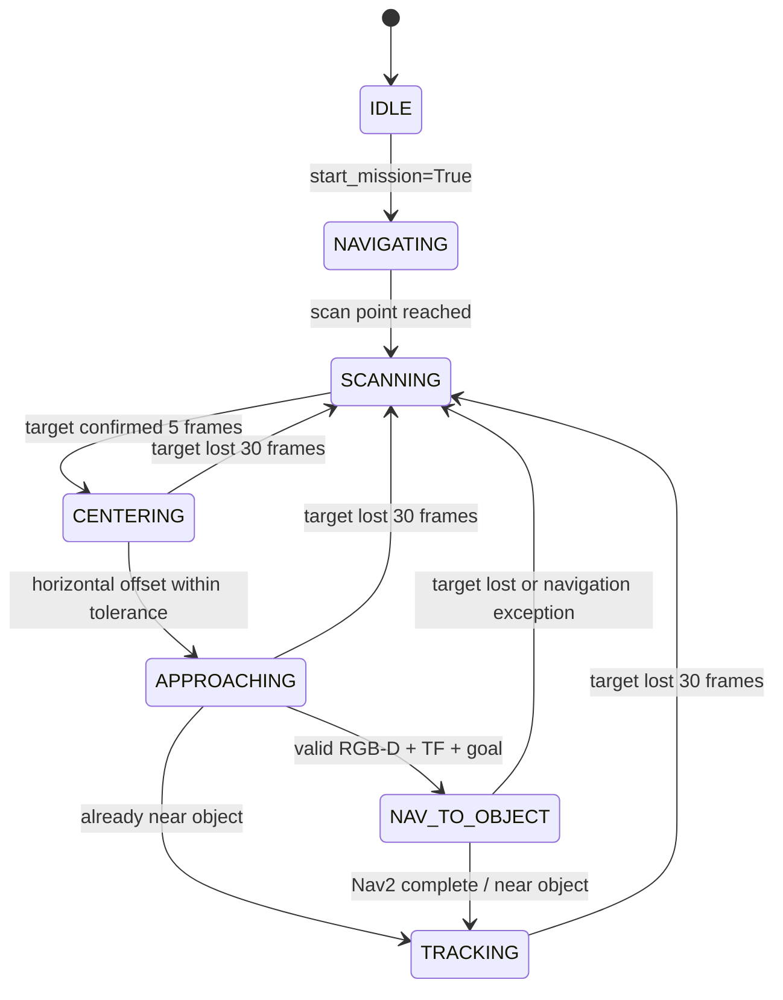

# TurtleBot 4 Hybrid Vision Navigation

YOLO 객체 인식, OAK-D RGB-D 거리 추정, TF2 좌표 변환, Nav2 장애물 회피와 근거리 visual tracking을 결합한 TurtleBot 4 미션 프로젝트입니다. 외부 웹캠에서 차량을 발견하면 미션을 시작하고, 지정 스캔 지점에서 대상을 탐색한 뒤 원거리에서는 Nav2, 근거리에서는 `/robot1/cmd_vel` 기반 비례 제어로 접근합니다.

> 이 저장소는 ROS 2 Humble과 TurtleBot 4 실기 환경을 전제로 합니다. Windows에서는 소스 정적 검증만 수행했으며 실제 로봇 실행 여부는 [Smoke Test](docs/SMOKE_TEST.md)로 확인해야 합니다.

## 1. Project Overview

- 플랫폼: TurtleBot 4, OAK-D RGB-D 카메라, 외부 USB 웹캠
- ROS 배포판: ROS 2 Humble
- 인식: Ultralytics YOLO, 사용자 학습 모델 `my_best_v2.pt`
- 원거리 이동: TurtleBot4Navigator/Nav2
- 근거리 이동: depth error와 이미지 중심 offset을 이용한 P-control
- 핵심 노드: `mission_controller`, `webcam_trigger`

## 2. Problem / Goal

카메라에서 검출한 이동 가능 객체에 접근할 때, 영상 오차만으로 장거리 주행하면 장애물 회피와 map 기반 경로 계획이 어렵습니다. 반대로 Nav2 goal만 사용하면 가까운 거리에서 움직이는 객체를 연속적으로 따라가기 어렵습니다. 이 프로젝트는 두 방식을 거리와 미션 상태에 따라 분리합니다.

1. 외부 웹캠으로 미션 시작 조건을 감지합니다.
2. 로봇이 사전 정의된 스캔 지점으로 이동합니다.
3. OAK-D 영상에서 목표 객체를 확정합니다.
4. RGB-D와 CameraInfo로 객체의 3차원 위치를 계산합니다.
5. TF2로 객체를 map 좌표로 변환하고 Nav2 goal을 생성합니다.
6. Nav2 접근 후에는 직접 Twist 명령으로 근거리 tracking을 수행합니다.

## 3. System Architecture



Nav2가 활성화된 `NAV_TO_OBJECT` 상태에서는 직접 `cmd_vel` 발행을 차단하여 두 제어기가 동시에 base를 제어하지 않게 합니다.

## 4. Mission Flow

1. `webcam_trigger`가 `cv2.VideoCapture(2)`로 외부 카메라를 엽니다.
2. class ID `1`을 검출하면 `/robot1/start_mission=True`를 발행합니다.
3. `mission_controller`가 초기 pose 설정, Nav2 활성화 대기와 undock을 수행합니다.
4. 고정 스캔 좌표 `[-1.9688931703567505, 0.21015524864196777]`로 이동합니다.
5. 약 `0.15 rad/s`로 회전하며 목표를 탐색합니다.
6. confidence `0.50` 이상 목표가 5프레임 연속 검출되면 중앙 정렬합니다.
7. 객체 pixel/depth를 map 좌표로 바꾸고 객체 전방 `0.75 m` 지점에 Nav2 goal을 전송합니다.
8. Nav2 완료 또는 근접 판정 후 `TRACKING`으로 전환합니다.
9. 근거리에서 depth/offset 기반 Twist를 발행하며 대상을 추적합니다.
10. 목표를 30프레임 연속 잃으면 정지 후 `SCANNING`으로 복귀합니다.

## 5. Hybrid Navigation Strategy

### Far field: obstacle-aware Nav2 approach

```text
YOLO bbox center
  → synchronized depth patch median
  → CameraInfo inverse projection
  → camera-frame PointStamped
  → TF2 map transform
  → object map position
  → robot/object geometry
  → stand-off Nav2 goal
  → obstacle-aware navigation
```

객체 위치가 바뀌어도 goal을 매 프레임 갱신하지 않습니다. 마지막 전송 후 2초 이상 지났고 map 기준 객체가 0.25m 이상 이동한 경우에만 기존 goal을 취소하고 새 goal을 보냅니다.

### Near field: visual tracking

근거리 제어는 PID가 아니라 비례 제어(P-control)입니다.

```text
distance_error = depth_m - desired_distance
linear.x       = clamp(0.35 × distance_error, 0.0, 0.12)
angular.z      = clamp(-0.4 × horizontal_offset, -0.15, 0.15)
```

- 기준 거리: `0.75 m`
- `0.65 m` 이하: 완전 정지
- `1.10 m` 이상: 최대 전진 속도 `0.12 m/s`
- 수평 offset 절댓값 `0.12` 미만: 회전 명령 0

코드는 좌우 wheel RPM을 직접 계산하지 않습니다. `/robot1/cmd_vel` 아래의 drivetrain 제어는 TurtleBot 4 base controller가 담당합니다.

## 6. Vision Pipeline

- 외부 webcam: 미션 시작용 class ID 1 검출
- OAK-D RGB: 로봇 시점 목표 검출
- OAK-D compressedDepth: bbox 중앙 주변 9×9 patch의 유효 depth median
- 목표 선택: confidence가 가장 높은 지정 class
- 로봇 측 목표 확정: confidence 0.50 이상, 5프레임 연속 검출

## 7. RGB-D / Depth Processing

RGB와 depth는 `ApproximateTimeSynchronizer`로 동기화합니다.

- queue size: 30
- 허용 시간 차: 0.50초
- compressedDepth의 12바이트 transport header를 제외한 PNG를 디코딩
- depth 값이 20보다 크면 millimeter로 간주해 meter로 변환
- 유효 범위: 0.05–10.0m
- 목표 depth가 2.0m를 넘으면 현재 미션 범위에서 depth jump로 보고 전진/goal 생성을 중단

## 8. Coordinate Transformation

CameraInfo의 `fx`, `fy`, `ppx`, `ppy`를 사용합니다.

```text
x = (u - ppx) × z / fx
y = (v - ppy) × z / fy
z = measured depth
```

결과를 camera optical frame의 `PointStamped`로 만들고 TF2를 통해 `map` frame으로 변환합니다. 로봇 위치는 namespaced/non-namespaced `base_link`와 `base_footprint` 후보에서 조회합니다.

## 9. Nav2 Integration

- `TurtleBot4Navigator`로 초기 pose, Nav2 활성화, undock, scan point 이동과 object goal 이동을 수행합니다.
- 객체와 로봇 사이의 벡터를 기준으로 객체 앞 `stop_distance`만큼 떨어진 goal을 계산합니다.
- goal orientation은 객체 방향을 바라보도록 설정합니다.
- 이 패키지는 Nav2 bringup이나 map server를 직접 실행하지 않습니다. 미션 launch 전에 TurtleBot 4/Nav2가 해당 map으로 활성화되어 있어야 합니다.

## 10. Near-field Visual Tracking

`TRACKING`에서는 YOLO bbox 중심의 수평 offset과 depth 오차를 사용합니다. depth 누락 또는 depth jump가 발생하면 정지하고 다음 프레임을 기다립니다. target lost count가 30에 도달하면 현재 Nav2 task를 취소하고 scanning으로 복귀합니다.

## 11. ROS 2 Nodes

| Node | Role |
|---|---|
| `webcam_trigger` | 외부 webcam index 2에서 차량을 검출하고 미션 시작 Bool 발행 |
| `mission_controller` | 스캔, RGB-D 인식, TF2, Nav2 접근, 근거리 tracking 통합 |

진단/실험 코드는 production console script에서 제외하고 [`tools/`](tools/)에 분리했습니다.

## 12. Important Topics

| Direction | Topic | Type | Purpose |
|---|---|---|---|
| Subscribe | `/robot1/start_mission` | `std_msgs/Bool` | 외부 webcam 미션 트리거 |
| Subscribe | `/robot1/oakd/rgb/image_raw/compressed` | `sensor_msgs/CompressedImage` | YOLO RGB 입력 |
| Subscribe | `/robot1/oakd/stereo/image_raw/compressedDepth` | `sensor_msgs/CompressedImage` | 목표 depth |
| Subscribe | `/robot1/oakd/stereo/camera_info` | `sensor_msgs/CameraInfo` | 카메라 내부 파라미터 |
| Publish | `/robot1/cmd_vel` | `geometry_msgs/Twist` | scanning, centering, tracking 직접 제어 |
| TF | `/robot1/tf`, `/robot1/tf_static` | TF2 | camera/base/map 변환 |

## 13. State Machine



`DONE` enum은 현재 정의되어 있지만 실제 transition에서는 사용하지 않습니다.

## 14. Tech Stack

- Python 3 / ROS 2 Humble / `rclpy`
- TurtleBot 4 / `turtlebot4_navigation`
- Nav2 / TF2
- OAK-D RGB-D camera
- OpenCV / NumPy
- Ultralytics YOLO
- `message_filters` ApproximateTimeSynchronizer

## 15. Project Structure

```text
.
├── README.md
├── LICENSE
├── package.xml
├── setup.py
├── setup.cfg
├── requirements.txt
├── launch/
│   └── mission.launch.py
├── rokey_pjt/
│   ├── __init__.py
│   ├── mission_controller.py
│   ├── model_paths.py
│   └── webcam_trigger.py
├── models/
│   └── my_best_v2.pt
├── maps/
│   ├── test_map.pgm
│   └── test_map.yaml
├── tools/
│   └── development and diagnostics scripts
└── docs/
    └── SMOKE_TEST.md
```

## 16. Installation

Ubuntu 22.04와 ROS 2 Humble이 설치되어 있다고 가정합니다.

```bash
sudo apt update
sudo apt install \
  ros-humble-cv-bridge \
  ros-humble-message-filters \
  ros-humble-tf2-geometry-msgs \
  python3-numpy \
  python3-opencv

python3 -m pip install -r requirements.txt
```

TurtleBot 4의 `turtlebot4_navigation` 패키지는 Robot/desktop 설치 절차에 따라 별도로 준비해야 합니다. 저장소를 ROS workspace의 `src/` 아래에 두고 `rosdep`을 실행할 수도 있습니다.

```bash
cd ~/your_ws
rosdep install --from-paths src --ignore-src -r -y
```

## 17. Build

```bash
cd ~/your_ws
colcon build --symlink-install --packages-select rokey_pjt
source install/setup.bash
```

## 18. Run

먼저 TurtleBot 4와 Nav2/map localization을 활성화한 후 실행합니다.

```bash
ros2 launch rokey_pjt mission.launch.py
```

별도 모델을 사용하려면 두 노드를 개별 실행하면서 동일한 경로를 전달할 수 있습니다.

```bash
ros2 run rokey_pjt mission_controller --ros-args -p model_path:=/path/to/model.pt
ros2 run rokey_pjt webcam_trigger --ros-args -p model_path:=/path/to/model.pt
```

## 19. Parameters

### `mission_controller`

| Parameter | Default | Meaning |
|---|---:|---|
| `model_path` | packaged model | YOLO weight path |
| `target_class_id` | `1` | target class |
| `camera_frame` | empty | optional optical frame override |
| `map_frame` | `map` | navigation/global frame |
| `stop_distance` | `0.75` | Nav2 goal stand-off distance |
| `min_goal_interval` | `2.0` | minimum seconds between replans |
| `replan_distance_threshold` | `0.25` | minimum object movement for replan |

### `webcam_trigger`

| Parameter | Default | Meaning |
|---|---:|---|
| `model_path` | packaged model | YOLO weight path |
| `target_class_id` | `1` | trigger class |

외부 webcam device index는 의도적으로 `2`에 고정되어 있습니다.

## 20. YOLO Model

`models/my_best_v2.pt`는 약 6.3MB로 GitHub 일반 Git의 단일 파일 제한보다 작습니다. 따라서 Git LFS 없이 일반 파일로 포함합니다. 모델의 class ID 의미는 학습 데이터와 함께 확인해야 하며 현재 코드는 `1`을 차량 target으로 사용합니다.

## 21. Troubleshooting / Limitations

- **Model not found**: `colcon build` 후 `source install/setup.bash`를 실행했는지 확인합니다.
- **Webcam open failure**: production trigger는 반드시 device index 2를 사용합니다. OS에서 `/dev/video2` 권한과 연결을 확인합니다.
- **CameraInfo/TF warning**: OAK-D CameraInfo와 camera optical frame → map TF가 필요합니다.
- **Nav2 does not move**: 이 launch는 Nav2 bringup을 포함하지 않습니다. localization, map server와 Nav2가 먼저 활성화되어야 합니다.
- **Depth decode failure**: 코드는 `compressedDepth`의 12-byte header + PNG 형식을 전제로 합니다.
- **Target class**: `target_class_id=1`의 의미는 제공 모델 학습 class와 일치해야 합니다.
- **Runtime validation**: 실제 Ubuntu/TurtleBot 환경에서의 실행은 아직 이 정리 환경에서 검증되지 않았습니다.
- **Maintainer metadata**: `package.xml`과 `setup.py`의 기존 maintainer 이름/이메일은 원본 그대로 보존했습니다. 공개 전 소유자가 직접 확인해야 합니다.

## License

Apache License 2.0. See [LICENSE](LICENSE).
