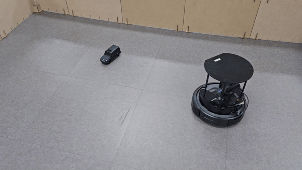
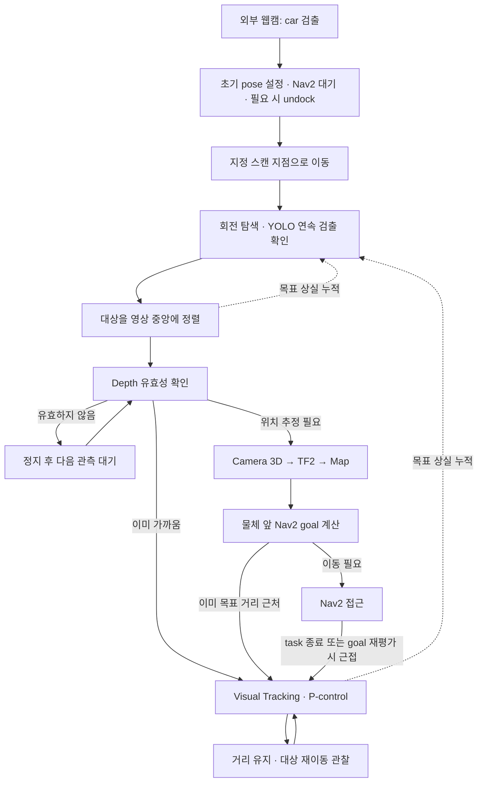
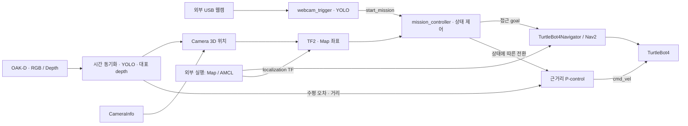

# TurtleBot4 Hybrid Vision Navigation

YOLO · OAK-D RGB-D · TF2 · Nav2 · Visual Tracking을 결합한 **TurtleBot4 물체 탐색 및 접근 시스템**입니다. 외부 웹캠에서 차량(`car`)을 검출하면 로봇이 지정된 스캔 지점으로 이동하고, OAK-D로 찾은 대상의 위치를 계산해 접근합니다.

지도 기반 이동은 Nav2가 담당하고, 목표 근처에서는 카메라의 수평 위치 오차와 depth를 이용한 P-control로 전환합니다. 접근 후에도 대상을 관찰하며 거리를 조절하고, 대상을 놓치면 회전 탐색으로 돌아갑니다.

## Demo

<p align="center">
  
  
</p>

실제 TurtleBot4와 차량 모형을 사용한 실기 동작을 두 시점에서 보여줍니다.

## Project Overview

영상에 보이는 물체까지 로봇을 이동시키려면 **어디에 있는지 추정하는 과정**과 **어떻게 접근할지 결정하는 과정**이 필요합니다. 이 프로젝트는 RGB 영상의 검출 결과를 depth와 결합해 지도 위 목표로 바꾸고, 마지막 접근 구간에서는 현재 영상에 반응하도록 두 제어 방식을 연결합니다.

외부 웹캠은 미션 시작 조건만 감지합니다. 실제 목표 위치 추정은 로봇에 장착된 OAK-D가 수행하며, `mission_controller`가 탐색·정렬·Nav2 접근·근거리 추적을 관리합니다. 지도와 localization, Nav2, 카메라 드라이버는 별도로 실행하는 구성입니다.

## Key Features

| 기능 | 설명 |
|---|---|
| YOLO 객체 검출 | 외부 웹캠으로 시작 조건을 감지하고 OAK-D 영상에서 지정 class의 대상을 선택 |
| RGB-D 위치 추정 | 시간 동기화한 RGB/depth와 CameraInfo로 대상의 카메라 기준 3D 위치 계산 |
| TF2 좌표 변환 | 카메라의 대상 위치와 로봇 base 위치를 `map` 기준으로 해석 |
| Nav2 접근 | 스캔 지점으로 이동한 뒤, 물체와 간격을 둔 접근 goal로 주행 |
| 근거리 Visual Tracking | 영상 중심 오차와 거리 오차를 P-control로 변환해 `cmd_vel` 발행 |
| 탐색 및 상태 제어 | 회전 탐색, 연속 검출 확인, 중앙 정렬, 목표 상실 시 재탐색 |

## Mission Workflow



이 흐름의 마지막은 일회성 완료가 아닌 지속적인 `TRACKING`입니다. Nav2 task 종료 판정은 이동 성공만을 뜻하지 않으며, 현재 상태 전환에는 성공·실패별 복구 분기가 없습니다.

## System Architecture



실행되는 프로젝트 노드는 `mission_controller`와 `webcam_trigger` 두 개입니다. 검출·3D 위치·추적 제어는 `mission_controller` 내부 처리이며, 별도의 detection/target 토픽으로 연결한 구조는 아닙니다.

## Vision & RGB-D

두 노드는 [my_best_v2.pt](models/my_best_v2.pt)를 Ultralytics YOLO로 불러옵니다. 모델 class는 `0: box`, `1: car`이며 기본 목표는 `target_class_id=1`입니다. 로봇 측에서는 confidence 기준을 통과한 후보 중 가장 높은 대상을 선택하고, 연속 검출을 확인한 뒤 정렬을 시작합니다.

OAK-D의 압축 RGB와 `compressedDepth`를 `ApproximateTimeSynchronizer`로 묶습니다. Depth는 transport header 뒤 PNG 데이터를 복원하고, bbox 중심 주변의 양수 depth 중앙값을 대표 거리로 사용합니다. 값의 크기를 기준으로 mm→m 변환을 적용하고 유효 거리 범위를 검사합니다. 접근 준비·근거리 추적에서 대표 depth를 얻지 못하면 정지하며, Nav2 이동 중에는 새 goal 갱신을 보류하고 기존 goal을 유지합니다.

**시간 동기화와 공간 정렬은 별개입니다.** 코드는 RGB의 bbox 중심 좌표를 depth 영상에 그대로 사용하고 `/robot1/oakd/stereo/camera_info`의 내부 파라미터를 적용합니다. 따라서 RGB/depth의 픽셀 대응과 CameraInfo가 일치하도록 OAK-D 입력을 준비해야 합니다. 이 저장소에는 별도 공간 정렬·재투영 단계가 없습니다.

## Coordinate Transform

CameraInfo에서 얻은 초점거리 `fx`, `fy`와 주점 `ppx`, `ppy`로 bbox 중심 `(u, v)`를 역투영합니다.

```text
X = (u - ppx) × Z / fx
Y = (v - ppy) × Z / fy
Z = 대표 depth (m)
```

이 점을 camera optical frame의 `PointStamped`로 만들고 TF2로 `map`에 직접 변환합니다. 카메라 frame은 `camera_frame` 설정 또는 RGB 메시지의 `frame_id`를 사용합니다. 로봇 위치는 `base_link` / `base_footprint` 후보에 대해 별도로 `map` 기준 TF를 조회합니다.

Camera → Robot Base → Map으로 이어지는 TF 연결은 로봇 시스템이 제공해야 합니다. 코드가 각 구간의 변환 행렬을 직접 계산하거나 TF를 발행하지는 않습니다. 변환된 객체 위치와 로봇 위치로 객체 앞의 접근 지점을 구하고, goal 방향은 객체를 바라보게 설정합니다. 구현은 [mission_controller.py](rokey_pjt/mission_controller.py)의 `pixel_depth_to_map_point`, `get_robot_map_xy`, `make_goal_in_front_of_object`에서 확인할 수 있습니다.

## Hybrid Navigation

| 구간 | 입력과 동작 | 전환 |
|---|---|---|
| Nav2 이동 | 지도 위 스캔 지점 또는 대상 앞 `PoseStamped`로 이동하며 경로 계획·장애물 회피를 Nav2에 맡김 | 객체 접근 task 종료 또는 goal 재평가 시 근접 판정 후 `TRACKING` |
| 근거리 Visual Tracking | bbox의 정규화된 수평 오차로 회전, 목표 depth와 기준 거리의 차이로 전진 속도 결정 | 가까우면 정지하고 관찰하며, 목표 상실이 누적되면 재탐색 |

Nav2는 지도 위 목표까지의 이동을 담당하고, 근거리 제어는 현재 영상에서 달라진 대상 위치에 반응합니다. 현재 근거리 제어는 **Visual Tracking 기반 P-control**이며 image Jacobian 기반 Visual Servoing은 아닙니다. 속도 제한과 오차 허용 구간을 적용하고, 전진·회전만 사용하며 후진하지 않습니다.

객체 goal은 물체 중심이 아니라 로봇 쪽으로 `stop_distance`만큼 떨어진 위치입니다. 기본 간격은 **0.75 m**이며 근거리 추적도 같은 기준 거리를 사용하지만, `stop_distance` ROS parameter가 근거리 기준까지 함께 바꾸지는 않습니다.

코드에는 일정 시간과 객체 이동량을 모두 만족할 때 goal을 다시 보내는 로직이 있습니다. 다만 현재 사용하는 `startToPose()`는 표준 Humble 구현에서 이동 종료를 기다리므로, 주행 중 영상에 따른 연속 재계획에는 제약이 있습니다. [TurtleBot4Navigator 구현](https://github.com/turtlebot/turtlebot4/blob/humble/turtlebot4_navigation/turtlebot4_navigation/turtlebot4_navigator.py)을 참고하세요.

## Mission / State Control

| 주요 상태 | 역할 |
|---|---|
| `IDLE` → `NAVIGATING` | 웹캠 트리거를 받아 초기 pose를 설정하고 스캔 지점으로 이동 |
| `SCANNING` → `CENTERING` | 같은 방향으로 회전 탐색을 반복하고, 확정한 대상을 영상 중앙에 정렬 |
| `APPROACHING` → `NAV_TO_OBJECT` | depth·CameraInfo·TF를 확인하고 접근 goal 생성; 이미 가까우면 `TRACKING`으로 이동 |
| `TRACKING` | 거리와 방향을 조절하며 대상을 계속 관찰 |

정렬·접근·추적 상태에서 미검출 프레임이 누적되면 정지하고 활성 Nav2 goal을 취소한 뒤 `SCANNING`으로 돌아갑니다. 객체 접근 task 확인 중 예외가 발생해도 재탐색합니다. 복구는 미검출 프레임 수에 기반하며, 모든 실패를 처리하는 통합 timeout/retry 정책은 없습니다.

`NAV_TO_OBJECT`에서는 일반 추적용 `cmd_vel` 발행을 막고 Nav2에 이동을 맡깁니다. 상태 전환·종료 시의 정지 명령은 별도로 발행합니다. 한 번 받은 시작 트리거는 다시 처리하지 않으며, 자동 완료·재시작 전환은 구현되어 있지 않습니다.

## Tech Stack

| 영역 | 기술 |
|---|---|
| 로봇·센서 | TurtleBot4, OAK-D RGB-D, 외부 USB 웹캠 |
| 실행 기반 | Python 3, ROS2 Humble, `rclpy` |
| Vision | Ultralytics YOLO, OpenCV, NumPy |
| RGB-D·좌표 | `message_filters`, CameraInfo, TF2 |
| Navigation | `turtlebot4_navigation`, Nav2, 외부 Map / AMCL |
| 근거리 제어 | P-control, `geometry_msgs/msg/Twist` |

## Repository Structure

```text
turtlebot4-vision-nav/
├── assets/                    # 실기 Demo GIF
├── rokey_pjt/
│   ├── mission_controller.py   # 탐색·RGB-D·TF2·Nav2·추적
│   ├── webcam_trigger.py       # 외부 웹캠 시작 조건
│   └── model_paths.py          # 설치된 모델 경로 해석
├── launch/mission.launch.py    # 두 노드 실행 및 TF remapping
├── models/my_best_v2.pt        # box / car 검출 모델
├── maps/
│   ├── test_map.yaml           # 지도 설정
│   └── test_map.pgm            # 점유 격자 지도
├── tools/                     # 카메라·depth·YOLO 진단 및 이전 접근 코드
├── docs/SMOKE_TEST.md          # 실기 점검 절차
├── package.xml                # ROS 의존성
├── setup.py                   # 실행 노드와 데이터 설치
└── requirements.txt           # Python 의존성
```

별도 mission parameter YAML은 없으며, 설정은 [노드 소스](rokey_pjt/mission_controller.py)와 [launch](launch/mission.launch.py)에 있습니다. `tools/`의 스크립트는 기본 미션에 포함되지 않습니다.

## Development Environment

- Ubuntu 22.04 / ROS2 Humble / Python 3 환경과 `colcon`, `rosdep`이 필요합니다.
- TurtleBot4 및 `turtlebot4_navigation`, Nav2·map server·AMCL을 준비합니다. 기본 namespace는 `robot1`입니다.
- OAK-D의 RGB/depth/CameraInfo와 camera·base·map TF 연결이 필요합니다. 외부 웹캠은 현재 코드에서 device index **2**를 사용합니다.
- YOLO 실행에 CUDA나 특정 GPU를 강제하는 설정은 없습니다. 추론 장치는 Ultralytics 기본 선택에 맡기며 처리 속도는 실행 장비에 따라 달라집니다.

## How to Run

### 설치 및 빌드

ROS2와 TurtleBot4 패키지를 준비한 Ubuntu 환경에서 실행합니다. 다음은 새 workspace를 만드는 예시입니다.

```bash
source /opt/ros/humble/setup.bash
mkdir -p ~/turtlebot4_ws/src
cd ~/turtlebot4_ws/src
git clone https://github.com/asdfzd/turtlebot4-vision-nav
cd ~/turtlebot4_ws
rosdep install --from-paths src --ignore-src -r -y
python3 -m pip install -r src/turtlebot4-vision-nav/requirements.txt
colcon build --symlink-install --packages-select rokey_pjt
source install/setup.bash
```

### 로봇·카메라 준비 및 미션 실행

1. **TurtleBot4 / Nav2:** 사용하는 로봇 환경에서 map server·AMCL·Nav2와 도킹 관련 인터페이스를 먼저 실행합니다. 미션은 초기 pose를 지도 원점, `NORTH` 방향으로 설정하고 고정 `SCAN_POINT`로 이동하므로 실제 지도·시작 위치가 코드 설정과 맞아야 합니다. [test_map.yaml](maps/test_map.yaml)은 포함되어 있지만 미션 launch가 자동으로 로드하지 않습니다.
2. **OAK-D / 외부 웹캠:** 아래 ROS2 Interface의 RGB/depth/CameraInfo 및 TF가 제공되도록 카메라 드라이버를 실행하고, 외부 웹캠 index 2를 연결합니다. 로봇과 실행 PC의 ROS 통신 환경도 일치시킵니다.
3. **Vision / Mission:** workspace 환경을 source한 터미널에서 실행합니다.

```bash
ros2 launch rokey_pjt mission.launch.py
```

이 launch는 `mission_controller`와 `webcam_trigger`를 함께 실행합니다. 외부 웹캠이 `car`를 감지하면 미션이 시작됩니다. Nav2 bringup과 OAK-D 드라이버 launch는 이 저장소에 포함되어 있지 않습니다.

4. **선택적 진단:** OAK-D 검출 화면을 확인하려면 별도 터미널에서 workspace 환경을 source한 뒤 실행합니다.

```bash
cd ~/turtlebot4_ws
source install/setup.bash
python3 src/turtlebot4-vision-nav/tools/robot_yolo_viewer.py
```

등록된 개별 실행 명령은 `ros2 run rokey_pjt mission_controller`와 `ros2 run rokey_pjt webcam_trigger`입니다. 개별 실행 시에는 [mission.launch.py](launch/mission.launch.py)의 namespace와 TF remapping을 함께 적용해야 합니다.

대상·모델을 바꿀 때는 두 노드의 `target_class_id`, `model_path`를 함께 맞춥니다. Nav2 접근 간격은 `stop_distance`로 조절하지만, 근거리 기준 거리·전환 조건은 `mission_controller.py`의 설정을 확인해야 합니다. 실기 점검 순서는 [Smoke Test](docs/SMOKE_TEST.md)를 참고하세요.

## ROS2 Interface

기본 `mission.launch.py`의 `robot1` 구성 기준입니다.

| 구분 | Topic / Action | Type | 역할 |
|---|---|---|---|
| 시작 신호 | `/robot1/start_mission` | `std_msgs/msg/Bool` | 웹캠 → 미션, transient-local QoS |
| RGB 입력 | `/robot1/oakd/rgb/image_raw/compressed` | `sensor_msgs/msg/CompressedImage` | YOLO 영상 |
| Depth 입력 | `/robot1/oakd/stereo/image_raw/compressedDepth` | `sensor_msgs/msg/CompressedImage` | bbox 중심 주변 거리 |
| 내부 파라미터 | `/robot1/oakd/stereo/camera_info` | `sensor_msgs/msg/CameraInfo` | 역투영에 사용할 K 행렬 |
| TF 입력 | `/robot1/tf`, `/robot1/tf_static` | `tf2_msgs/msg/TFMessage` | 카메라·base·map 관계 |
| 이동 Action | `/robot1/navigate_to_pose` | `nav2_msgs/action/NavigateToPose` | Navigator를 통한 지도 기반 이동 |
| 직접 속도 출력 | `/robot1/cmd_vel` | `geometry_msgs/msg/Twist` | 회전 탐색·정렬·근거리 추적 |

대상 검출과 `PointStamped` / `PoseStamped` 생성은 노드 내부에서 수행합니다. `NavigateToPose`와 AMCL 연동은 [Nav2 BasicNavigator](https://github.com/ros-navigation/navigation2/blob/humble/nav2_simple_commander/nav2_simple_commander/robot_navigator.py)를 사용하는 TurtleBot4Navigator를 통해 이루어집니다.

## Engineering Highlights

| 문제 | 원인 | 구현한 대응 |
|---|---|---|
| RGB 검출과 depth 관측 시점 차이 | 두 스트림이 독립적으로 도착 | 근사 시간 동기화 후 한 쌍으로 처리 |
| 중심 픽셀의 depth 누락·불안정 | 0 값이나 대상 경계의 거리 차이 | 중심 주변 양수 depth 중앙값과 거리 범위 검사 |
| 영상 위치를 주행 목표로 바로 사용하기 어려움 | 픽셀·카메라·지도 좌표계가 다름 | CameraInfo 역투영과 TF2 변환 후 물체 앞 goal 계산 |
| Nav2 접근 이후 세밀한 방향·거리 조절 | 지도상의 접근 지점과 현재 관측 대상 간 차이 | 근거리에서 수평·거리 오차 기반 P-control로 전환 |
| 추적 중 목표 상실 | 가림 또는 검출 누락 | 미검출 누적 시 정지·goal 취소 후 회전 재탐색 |

## Limitations

- **인식 범위:** 제공 모델의 `box` / `car` class와 학습 조건에 의존합니다. 매 프레임 최고 confidence 대상을 고르므로 같은 class의 여러 객체 사이에서 동일 대상을 보장하지 않습니다.
- **거리·좌표 정확도:** depth 가림·누락과 RGB/depth 공간 정렬, CameraInfo·TF 정확도에 영향을 받습니다. 현재 객체 접근·추적은 대표 depth **2 m 초과**를 유효한 목표 거리로 사용하지 않습니다.
- **환경 의존:** 지도·localization과 고정 초기 pose·스캔 지점이 실제 공간에 맞아야 합니다. 다른 공간을 자동으로 탐색해 지도를 만들지는 않습니다.
- **근거리 제어:** P-control에는 별도 장애물 회피나 후진 제어가 없습니다. 카메라 입력 중단을 감시하는 별도 watchdog도 없어 모든 관측 장애에서 즉시 정지하는 구조는 아닙니다.
- **이동 대상과 복구:** Nav2의 blocking 호출로 이동 중 목표 갱신·상실 대응에 제약이 있고, `TRACKING`에서 멀어진 대상을 자동으로 Nav2에 다시 넘기는 전환은 없습니다. 이동 실패별 재시도와 자동 미션 완료도 추가 구현이 필요합니다.

## Future Work

- Detection confidence와 depth 분산을 함께 사용해 목표 위치의 불확실성을 평가하고 필터링합니다.
- 객체 ID 추적과 시간에 따른 위치 융합으로 동일 대상 유지와 이동 대상 추정을 개선합니다.
- Nav2 실행을 비동기로 분리하고, 거리·관측 신뢰도에 따른 Nav2 ↔ Tracking 양방향 전환을 추가합니다.
- 입력 중단 감시와 근거리 장애물 대응, 이동 실패·재시도·종료 정책을 보강합니다.
- 가림·다중 객체·이동 장애물을 포함한 전체 미션 시나리오에서 접근 오차와 복구 동작을 평가합니다.

## License

[Apache License 2.0](LICENSE)
